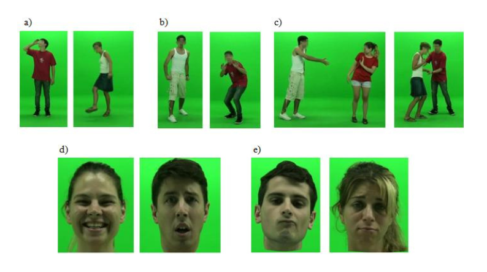

## ¿Dónde hice mi doctorado?
Me doctoré en marzo del 2020 (¡que época especial!) en la [Facultad de Psicología de la Universidad de Buenos Aires](http://www.psi.uba.ar/) (Argentina) con la tesis titulada **Reconocimiento de expresiones emocionales corporales en pacientes con lesiones del hemisferio derecho.** Mi director de tesis fue el Dr. Aldo Ferreres y realicé mis actividades de investigación con una beca doctoral UBACyT. El jurado que me evaluó estuvo compuesto por la Dra. Débora Burin, el Dr. Ricardo Allegri, y el Dr. José Alberto Chiapella.  

## ¿Qué trabajo hice para la tesis?
Mi trabajo doctoral se enmarcó en el área de la *Neuropsicología Clínica*, una rama de la práctica profesional de la salud humana que se ocupa del estudio de las *alteraciones cognitivas* que se producen como consecuencia de una *disfunción cerebral*.

En mi estudio, analicé las alteraciones del procesamiento de gestos emocionales en personas adultas con lesiones cerebrales adquiridas del **hemisferio derecho**. Particularmente, apliqué un protocolo de evaluación para caracterizar la habilidad de los pacientes para reconocer **expresiones emocionales corporales** e identificar si conservaban la capacidad para interpretar emociones básicas (ej. miedo) y complejas (ej. vergüenza) a partir de los gestos corporales exhibidos por otras personas.  

---

<figure>
    
    <figcaption>Capturas de pantalla de los videos utilizados para evaluar a los participantes de la investigación.</figcaption>
</figure>

---

Además, analicé si la habilidad para reconocer expresiones emocionales **corporales** podría considerarse un proceso cognitivo *diferente* a la habilidad utilizada para reconocer expresiones emocionales **faciales**. Para ello, observamos los patrones de disociaciones clásicas y fuertes que presentaban los pacientes entre los diferentes tipos de estímulos usados en la evaluación: *cuerpo* vs *rostro*. 

Por último, examinamos la influencia de otras variables cognitivas sobre el reconocimiento de expresiones emocionales corporales: velocidad de procesamiento, amplitud atencional verbal y visuoespacial, atención selectiva visual, memoria de trabajo, y percepción visual simple y compleja.

### ¿Cuáles fueron los principales resultados de mi trabajo doctoral?
En resumidas cuentas:  

* Las alteraciones de la capacidad para reconocer expresiones emocionales corporales fueron una característica frecuente de los pacientes con lesiones del hemisferio derecho. En nuestra muestra hallamos una frecuencia de alteración del 85%. Incluso, fue más frecuente la alteración en el reconocimiento de expresiones corporales que la alteración en el reconocimiento de expresiones faciales.

*	Las alteraciones del reconocimiento de expresiones corporales y faciales estuvieron relacionadas. Se observó que a mayor alteración de una, mayor afectación de la otra.

* Si bien hubo relación entre las habilidades para reconocer expresiones corporales y faciales, se hallaron casos de pacientes con disociaciones de rendimiento. Es decir, es posible que los pacientes tengan dificultades para reconocer expresiones corporales pero conserven el reconocimiento con expresiones faciales. Esto apoya a la teoría de independencia del procesamiento facial y corporal.

*	Los pacientes con lesiones del hemisferio derecho también presentaron déficits cognitivos no-emocionales, principalmente de procesos atencionales y perceptivos visuales, pero ellos no explicaron las alteraciones de reconocimiento de expresiones emocionales corporales. 

### ¿Cuáles son las preguntas que quedaron sin resolver?
¡Varias! Algunas teóricas y otras clínicas. Pero por mi formación fuertemente clínica, una de las preguntas que más me interesaría resolver en trabajos futuros es estimar cuánto de las alteraciones del reconocimiento de expresiones corporales y faciales **impactan sobre la vida cotidiana** de los pacientes. 

Abordar la relación entre los aspectos de **nivel cognitivo** con aquellos de **nivel conductual** y **funcional** es uno de los desafíos más grandes que enfrenta la neuropsicología. Ello se vuelve especialmente desafiante en el estudio de la cognición social porque implica abordar habilidades que se ponen en funcionamiento en un amplio abanico de situaciones sociales en donde influyen muchas variables que afectan a nuestras interacciones interpresonales.

### Disgresiones para el cierre...
Hacer la tesis doctoral en el marco de una beca de doctorado te *obliga*, por decirlo de una manera, a cumplir con tiempos y plazos acotados. Además, cuando estás en la carrera académica, hay muchas presiones más allá de realizar el doctorado (juntar antecedentes de docencia, hacer pasantías de investigación, voluntariados, publicar ¡demasiado! no solo en tu idioma sino en inglés, asistir a congresos - por fuera de tu país y, en mi caso, con mis propios recursos -, además de juntar los créditos académicos y cumplir con las obligaciones del doctorado, entre otras cosas). Fue una experiencia profesional increíble pero la verdad es que afectó mi salud mental (¡hola, trastorno de ansiedad!). Y, lamentablemente, es muy frecuente que los doctorandos vean afectada su salud [(link a uno de los tantos estudios que reportan este problema](https://doi.org/10.1057/s41599-021-00983-8)). El sistema científico y las personas que toman decisiones en ciencia deben replantearse muchas cosas, y rápido.  
Yo terminé entregando mi tesis apurada porque necesitaba terminar para postularme a una beca postdoctoral. Y, si bien creo que me quedó bastante linda, está llena de errores y cosas que hubiese hecho de otra manera si hubiese tenido más tiempo (y mejor salud mental!). También me sucedió que aprendí muchas cosas de estadística y visualización de datos después de terminar el doctorado! Hay unos gráficos de torta que detesto de la tesis y vaaarias otras cosas. Pero bueno, como dice el famosos proverbio académico "**la tesis no se termina, se entrega**".

##### Nota final: ¿Dónde leer la tesis completa?
Si te levantaste con tiempo de vida de sobra y te agarra un profundo deseo de leer la tesis (¿?), podés acceder al texto completo en el siguiente link: [pdf de la tesis](/pdf/1_Tesis_Leiva.pdf).

