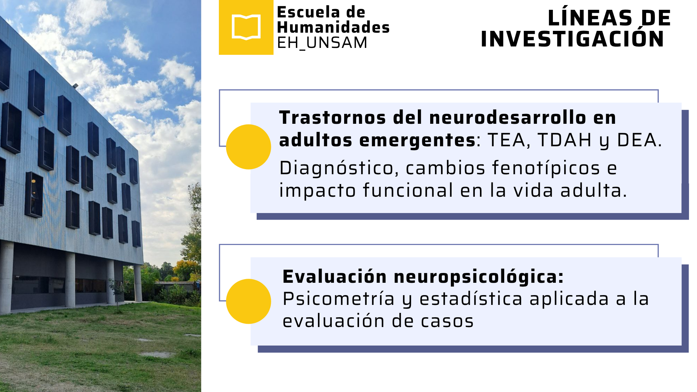

## Presentación

Este equipo de trabajo se enfoca en el estudio de diversos **Trastornos del neurodesarrollo (TND) en personas adultas**. Estudiamos las particularidades de los procesos diagnósticos de adultos no diagnosticados en la infancia, los cambios fenotípicos que atraviesan los pacientes con TND, las características de procesamiento cognitivo y su relación con la conducta, y el impacto funcional asociado.

Nuestras investigaciones se centran en pacientes adultos con:
* Trastorno del Espectro Autista (TEA)
* Trastorno por Déficit de Atención/Hiperactividad (TDAH)
* Dificultades Específicas del Aprendizaje (DEA)  

Realizamos nuestro trabajo en conjunto con la [Unidad de Neuropsicología del HIGA Eva Perón](/project/unp/)

## Líneas de investigación

## Integrantes

**Directora**: Dra. Samanta Leiva.

**Pasantes**: Carla Barbagallo (Lic. en Psicopedagogía), Giselle Insfran (Lic. en Psicología), Belén Reniero Paretto (estudiante avanzada de Psicología).

**Colaboradoras**: Integrantes de la Unidad de Neuropsicología del HIGA Eva Perón de San Martín Dra. Andrea Micciulli, Lic. Laura Margulis, Lic. María Marta Sanguinetti.

**Supervisor externo**: Dr. Aldo Ferreres.

## Contacto

Si te interesa integrar el equipo o proponer alguna colaboración, escribinos a **sleiva\@unsam.edu.ar**