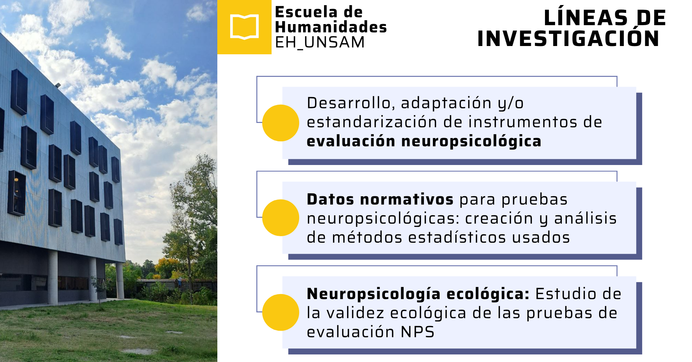

## Presentación

Este equipo de trabajo se propone mejorar la disponibilidad de instrumentos de evaluación neuropsicológica al aplicar avances psicométricos y estadísticos al servicio de la neuropsicología. Principalmente, se orienta al **estudio de la calidad psicométrica de los instrumentos y procedimientos de evaluación neuropsicológica**, y al estudio de los **modelos estadísticos** que se utilizan para comparar el rendimiento de un paciente contra los datos normativos de las pruebas de evaluación.

## Líneas de investigación

-   **Estandarización de procesos de evaluación y diagnóstico neuropsicológico**: Incluye el desarrollo, adaptación y/o estandarización de instrumentos de evaluación neuropsicológica de screening cognitivo y específicos para funciones. Estudio de las propiedades psicométricas de los instrumentos.

-   **Datos normativos de pruebas neuropsicológicas:** Análisis de métodos estadísticos para el desarrollo de baremos y para la comparación del rendimiento de un caso contra un grupo de referencia. Creación y actualización de datos normativos de pruebas neuropsicológicas para Argentina.

-   **Neuropsicología ecológica:** Estudio de la validez ecológica de los instrumentos de evaluación neuropsicológica; relación entre la presencia de alteraciones neuropsicológicas y variables funcionales: queja cognitiva, desempeño académico, actividades de la vida diaria, integración a la comunidad, participación social, entre otras.

## Transferencia

Los resultados del equipo de trabajo tienen **impacto directo sobre la clínica neuropsicológica** al generar: **A)** herramientas más precisas para la estimación de funciones cognitivas y/o detección de alteraciones patológicas de la cognición; **B)** datos normativos con modelos estadísticos más precisos; **C)** herramientas con buena capacidad predictiva del impacto de las alteraciones neurocognitivas en la vida cotidiana.

Se ofrecen charlas y cursos de formación para equipos de neuropsicólogos clínicos que deseen debatir avances psicométricos y estadísticos aplicados a la evaluación.

## Integrantes

**Directora**: Dra. Samanta Leiva.

**Pasantes**: Lic. Carla Barbagallo, Lic. Marta Silva, Lic. Ornella Blengino, Lic. Carla Meyer, Lic. Nadia Dowzuk, Lic. Patricia Peña Rodríguez.

**Colaboradoras**: Integrantes de la Unidad de Neuropsicología del HIGA Eva Perón de San Martín Dra. Andrea Micciulli, Lic. Laura Margulis, Lic. María Marta Sanguinetti.

**Supervisor externo**: Dr. Aldo Ferreres.

## **Contacto**

Si te interesa integrar el equipo o proponer alguna colaboración, escribinos a **sleiva\@unsam.edu.ar**
