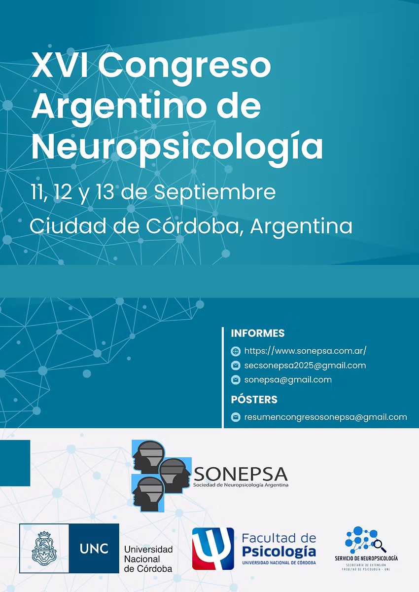

## ¿Qué es SONEPSA? 
La Sociedad de Neuropsicología de Argentina, SONEPSA, fue fundada en 1987 con el objetivo de promover la investigación, asistencia y formación de profesionales dedicados a la neuropsicología. Se compone de miembros provenientes de diversas disciplinas de todo el país.
Cada año, realiza distintas actividades científicas como cursos, talleres, seminario, jornadas y otros espacios de encuentro que contribuyen al debate y actualización constante del campo neuropsicológico. 

**Sitio web:** https://www.sonepsa.com.ar/

### Congreso Argentino de Neuropsicología
Cada dos años, SONEPSA organiza un evento único en el país que reúne a prestigiosos invitados nacionales y extranjeros, así como a toda la comunidad científica y profesional interesada en la clínica y la investigación neuropsicológica.

### Revista Argentina de Neuropsicología
Desde el año 2003, SONEPSA edita una revista académica de acceso abierto, libre y gratuito que publica artículos en español, con el objetivo de difundir investigaciones originales del campo de la neuropsicología y disciplinas afines. 
La revista publica dos números por año (en junio y diciembre) en formato electrónico y mantiene una política de acceso abierto, sin cobrar ni a los autores ni a los lectores por su uso. 

**Sitio web de la revista:** https://www.revneuropsi.com.ar/

## Mi participación en SONEPSA
Desde el año 2021, formo parte de la Comisión Directiva de SONEPSA, en diferentes cargos. Como parte de mi rol de gestión, participo en la organización de las distintas ediciones del Congreso Argentino de Neuropsicología y de los encuentros de formación y actualización para socios/as.

---

## Novedades
### 2025
Estamos organizando el **XVI Congreso Argentino de Neuropsicología** que será los días 11, 12 y 13 de septiembre de 2025 en la Ciudad de Córdoba.

<figure>
    
</figure>

---

