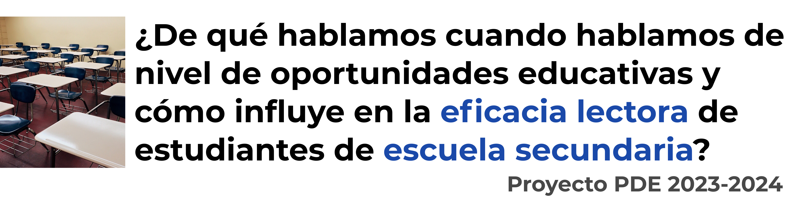
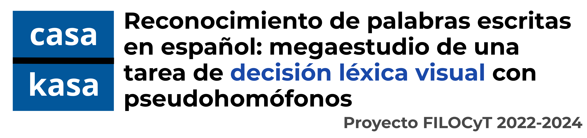
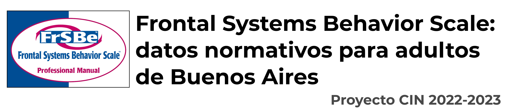
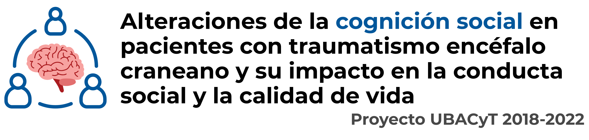
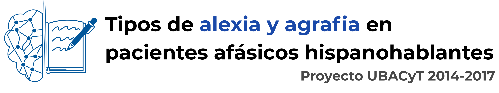
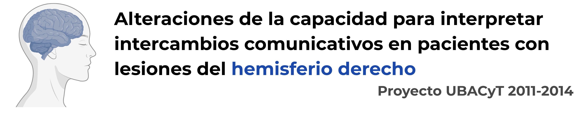

#### Desde el año 2011 tuve el privilegio de participar como pasante, luego como becaria y, finalmente, como investigadora en diferentes proyectos de investigación llevados a cabo en la Universidad de Buenos Aires.

### 2023 - 2024

**Directora del proyecto:** Dr. Valeria Abusamra.  
**Co-directora:** Dra. Nancy China.  
**Lugar de trabajo:** Facultad de Filosofía y letras de la UBA.  
**Rol desempeñado:** Investigadora para asesoramiento estadístico.  
**Financiamiento:** Secretaría de Ciencia y Técnica de la Universidad de Buenos Aires.

### 2022 - 2024

**Directora del proyecto:** Dr. Micaela Difalcis.  
**Co-directora:** Dra. Bárbara Sampedro.  
**Lugar de trabajo:** Facultad de Filosofía y letras de la UBA.  
**Rol desempeñado:** Investigadora externa, asesoramiento estadístico.  
**Financiamiento:** Facultad de Filosofía y letras de la UBA.

### 2022 - 2023

**Becaria CIN:** Natalia Camilotto.  
**Directora:** Dra. Samanta Leiva.  
**Co-director:** Dr. Aldo Ferreres.  
**Lugar de trabajo:** Instituto de Investigaciones de la Facultad de Psicología UBA.  
**Rol desempeñado:** Supervisión.  
**Financiamiento:**  Consejo Interuniversitario Nacional (CIN).

### 2018 - 2022

**Director del proyecto:** Dr. Aldo Ferreres.  
**Co-directora:** Dra. Valeria Abusamra.  
**Lugar de trabajo:** Instituto de Investigaciones de la Facultad de Psicología UBA.  
**Rol desempeñado:** Becaria postdoctoral.  
**Financiamiento:** Secretaría de Ciencia y Técnica de la Universidad de Buenos Aires.

### 2014 - 2017

**Director del proyecto:** Dr. Aldo Ferreres.  
**Co-directora:** Dra. Valeria Abusamra.  
**Lugar de trabajo:** Instituto de Investigaciones de la Facultad de Psicología UBA.  
**Rol desempeñado:** Becaria doctoral.  
**Financiamiento:** Secretaría de Ciencia y Técnica de la Universidad de Buenos Aires.

### 2011 - 2014

**Director del proyecto:** Dr. Aldo Ferreres.  
**Lugar de trabajo:** Instituto de Investigaciones de la Facultad de Psicología UBA.  
**Rol desempeñado:** Pasante primero y becaria doctoral luego.  
**Financiamiento:** Secretaría de Ciencia y Técnica de la Universidad de Buenos Aires.
