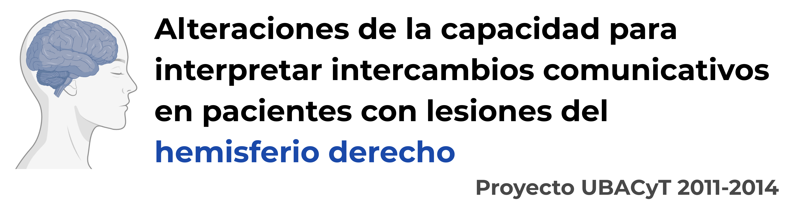

Desde el año 2011 tuve el privilegio de participar como pasante, luego becaria y, finalmente, como investigadora en diferentes proyectos de investigación llevados a cabo en la Universidad de Buenos Aires.

## 2011 - 2014

#### Resumen

Los pacientes con lesiones del hemisferio derecho (LHD) no muestran un cuadro afásico típico pero presentan un importante compromiso de la comunicación debido a sus dificultades para el uso del lenguaje en contexto.Los déficits se centran en cuatro grandes áreas del desempeño pragmático: prosodia, semántica léxica, habilidades discursivas y peticiones indirectas. Las características precisas de estas dificultades y sus formas de presentación clínica aún son objeto de estudio. Entre los déficits asociados se han observado déficits ejecutivos, de la percepción de claves emocionales y de la habilidad para inferir estados mentales o habilidades TOM (teoría de la mente). La contribución relativa de estos déficits a las alteraciones de la comunicación en pacientes LHD es objeto de estudio actual. Un problema metodológico consiste en para evaluar las habilidades TOM se recurre habitualmente a tareas que requieren comprensión de textos, habilidad afectada de por sí en estos pacientes. El objetivo del proyecto es estudiar las alteraciones de la capacidad para interpretar intercambios comunicativos en pacientes con LHD ubicando el problema en el marco de la cognición social (más que la pragmática lingüística) y utilizando tareas más ecológicas (intercambios comunicativos en video). Se comparará el rendimiento de un grupo de 40 pacientes LHD con el de un grupo control en una tarea de inferencia social (interpretar el sentido de intercambios comunicativos grabados en video) y se estudiará la asociación del rendimiento en dicha tarea con el de pruebas que evalúan habilidades cognitivas, lingüísticas, emocionales y de inferencia de estados mentales.

**Director del proyecto:** Dr. Aldo Ferreres.  
**Lugar de trabajo:** Instituto de Investigaciones de la Facultad de Psicología UBA.  
**Rol desempeñado:** Pasante primero y becaria doctoral luego.  
**Financiamiento:** Secretaría de Ciencia y Técnica de la Universidad de Buenos Aires.
