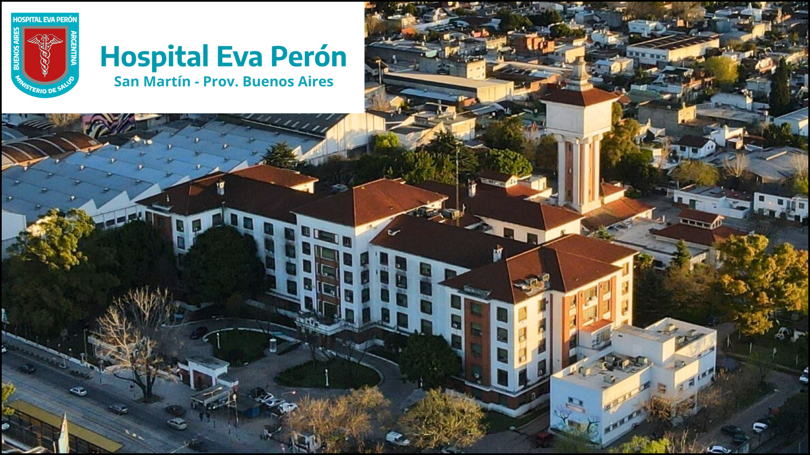

------------------------------------------------------------------------

## ¿Qué es la Unidad de Neuropsicología?

Es un centro de **asistencia clínica para personas adultas con patologías cerebrales** que afectan a la mente y/o a la conducta, y forma parte de los servicios del [Hospital Interzonal General de Agudos *Eva Perón*](https://www.ms.gba.gov.ar/sitios/hospitalevaperon/), ubicado en San Martín, Provincia de Buenos Aires (Argentina).  
En la Unidad atendemos a pacientes con diversas patologías y condiciones que afectan al sistema nervioso como como accidentes cerebrovasculares, epilepsias, deterioro cognitivo, discapacidad intelectual, déficit de atención, traumatismos de cráneo, etc., como así también de patologías sistémicas con afectación secundaria del cerebro como SIDA, enfermedades reumáticas, hipotiroidismo, u otras patologías del área de la psiquiatría como esquizofrenia, depresión, ansiedad, entre muchas otras. Nuestra especialidad se enfoca en las dificultades cognitivas, afectivas y de la conducta que se pueden presentar en cada caso.  
Como todos los hospitales públicos de Argentina, el Hospital Eva Perón ofrece asistencia **pública y gratuita** a toda la población que lo necesite.

### Integrantes

El equipo de la Unidad está formado por profesionales de las áreas de Neurología, Psicología, y Terapia Ocupacional, y trabajamos en interdisciplina con otros servicios del hospital y áreas de la salud.

-   Dra. Andrea Micciulli, médica neuróloga, jefa de la Unidad.
-   Dr. Aldo Ferreres, médico neurólogo, consulto.
-   Lic. Laura Margulis, psicóloga especialista en neuropsicología.
-   Dra. Samanta Leiva, psicóloga especialista en neuropsicología.
-   Lic. Úrsula Peiretti, psicóloga especialista en neuropsicología.
-   Lic. Ángeles Barrera, psicóloga especialista en neuropsicología.
-   Lic. María Marta Sanguinetti, terapista ocupacional especialista en neuropsicología.

### Contacto

**Dirección:** Av. 101 Dr. Ricardo Balbín 3200, San Martín (CP 1650), Buenos Aires, Argentina. [Link a Google Maps](https://www.google.com/maps/place/Hospital+Interzonal+General+de+Agudos+%22Eva+Per%C3%B3n%22+(ex+Castex)/@-34.571897,-58.554557,16z/data=!4m14!1m7!3m6!1s0x95bcb761e54e8f3f:0x14ceb39f7f497c7f!2sHospital+Interzonal+General+de+Agudos+%22Eva+Per%C3%B3n%22+(ex+Castex)!8m2!3d-34.5718974!4d-58.5545567!16s%2Fg%2F1q628q1yq!3m5!1s0x95bcb761e54e8f3f:0x14ceb39f7f497c7f!8m2!3d-34.5718974!4d-58.5545567!16s%2Fg%2F1q628q1yq?hl=es&entry=ttu)  
**Teléfono:** 4724-3000 interno 3141 (lunes a viernes de 8 a 13 hs)  
**Whatsapp (solo mensajes):** +54 11 6482 7748 (respuestas de lunes a viernes de 8 a 13 hs)
